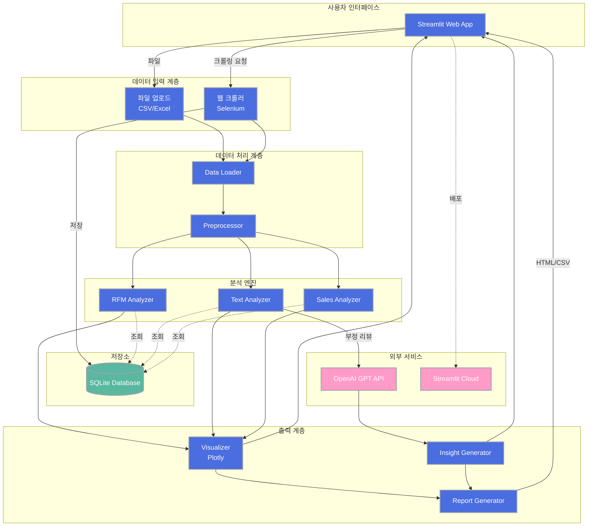

# System Architecture Diagram

## 주요 구성 요소

### 사용자 인터페이스
- **Streamlit Web App**: 멀티페이지 구조의 대화형 웹 인터페이스

### 데이터 입력 계층
- **파일 업로드**: CSV/Excel 파일 지원 (최대 100MB)
- **웹 크롤러**: Selenium 기반 네이버 크롤링 (로컬 환경)

### 데이터 처리 계층
- **Data Loader**: 파일 인코딩 감지 및 데이터 로딩
- **Preprocessor**: 결측치, 이상치, 파생변수 처리

### 분석 엔진
- **RFM Analyzer**: K-Means 군집화 기반 고객 세분화
- **Text Analyzer**: 키워드 추출, 감성 분석, 토픽 모델링
- **Sales Analyzer**: 시계열 분석, 상품 순위, 파레토 분석

### 출력 계층
- **Visualizer**: Plotly 인터랙티브 차트 생성
- **Insight Generator**: 핵심 발견사항 및 액션 아이템 생성
- **Report Generator**: HTML/CSV 리포트 다운로드

### 저장소
- **SQLite Database**: 크롤링 데이터 및 분석 결과 저장

### 외부 서비스
- **OpenAI GPT API**: 부정 리뷰 심층 분석
- **Streamlit Cloud**: 무료 호스팅 플랫폼
